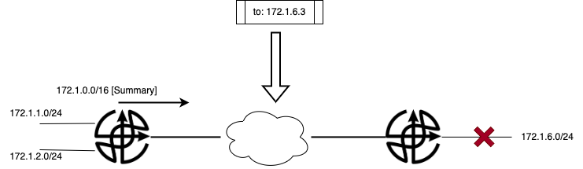

## Advantage
1. Save the network resource by reducing the route table.
2. Reduce network update by hiding the unstable network.
## Disadvantage
1. Reduce the precision of the route table, thus could make route loop in particular scenario.

3. Asymmetry route in particular scenario.